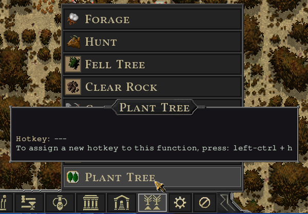

# Songs of Syx Plant Tree Mod

Ported to v65 by [VizardAlpha](https://github.com/VizardAlpha) <3

## Description

Mod for the game [Songs of Syx](https://store.steampowered.com/app/1162750/Songs_of_Syx/).
Adds a job for planting trees on fertile soil.


Find it in the settlements bottom menu:



### New modding possibility

The mod uses a new way to hook into the game - possible since V64 of the game.
There's now a way to extend from package private classes / constructors and even replace whole game classes with your own code.
The custom mod class has to have the same package to access package private game classes.

I'm using this to make a custom [PlantTreeJob.java](https://github.com/4rg0n/songs-of-syx-mod-plant-trees/blob/master/src/main/java/settlement/job/PlantTreeJob.java) to extend from the games JobBuild class with a package private constructor. With this new method it's possible to replace whole sections of the game with your own. Thx Jake =D

## Getting started

[Maven](https://maven.apache.org/) is required to compile, package and install the mod.

**(1)** Do all at once: Install games jar file as dependency; compile mod source; prepare mod file structure; copy mod files to game mod directory
```
mvn validate install
```

**(!)** Game installation and mod directory paths are configured in the `pom.xml` in the `<profiles>` and are default set to:

**Game Installation**
* **Windows:** C:\Program Files (x86)\Steam\steamapps\common\Songs of Syx
* **Linux:** ~/.steam/steam/SteamApps/common/Songs of Syx

**Mod Directory**
* **Windows:** ${user.home}/AppData/Roaming/songsofsyx/mods/
* **Linux:** ~/.local/share/songsofsyx/mods/


**(2)** Run the game and you should see a `Plant Trees` mod. Activate it and launch.

**(3)** Start a new game. In the new game settings activate the `Plant Trees` under **Scripts**.

## Build commands

**(i)** Installs only the games `SongsOfSyx.jar` and `info/SongsOfSyx-sources.jar` as a dependency, and validate whether it was successful.
```
mvn validate
```

**(!)** This is required or the project won't find the games code.

**(i)** Building the mod only into `target/out`:
```
mvn package
```

The source code of the mod will be copied into e.g. `target/out/songs-of-syx-mod-example/V63/script/_src`.

**(i)** Build and copy the output into the games mods folder (excluding `_src`):
```
mvn install
```

**(!)** The games mod folder location varies on each OS. There are maven profiles "windows" and "linux". The "windows" profile is the default.
Maven should detect when you are building on a Linux OS and switch to the "linux" profile (not tested).
You can force a profile with e.g.

```
mvn install -P linux
```

**(i)** Deletes the `target` directory containing the packaged mod files and removes the mod from the games mod directory.
```
mvn clean
```

## Mod Info / Build Settings

In the `pom.xml` you will find `<properties>` where you can change information about the mod.
There you can also change the `<game.version.major>` property to your used game version.
The `<game.version.minor>` property is only important when your mod really depends on stuff in this version and isn't compatible with lower versions.

Files (e.g. assets) for the mod are located in `src/main/java/resources/mod-files` and will be copied in the `package` phase.

## Debugging

You can enable **Debug Mode** and **Developer Mode** in the game launcher **settings**.
You will get more detailed logs and in-game developer tools for testing.

### Intellij IDEA

There are two `.xml`files in the `.run/` folder:

* `Main.run.xml` launches the game directly
* `MainLaunchLauncher.run.xml` starts the game launcher

You may want to edit the `WORKING_DIRECTORY` option to your local game installation path.
It's default set to: `C:/Program Files (x86)/Steam/steamapps/common/Songs of Syx`.

They should be automatically available [in the IDE](https://www.jetbrains.com/help/idea/run-debug-configuration.html).
You can also edit them there :)

### Eclipse

* Add a new [Run Configuration](https://www.subjectcoach.com/tutorials/detail/contents/beginners-guide-to-eclipse-ide/chapter/working-with-run-configurations).
* Set the **main class** name to `init.MainLaunchLauncher`.
* In the tab **Arguments** set the **working directory** to your game installation folder e.g. `C:/Program Files (x86)/Steam/steamapps/common/Songs of Syx`.
